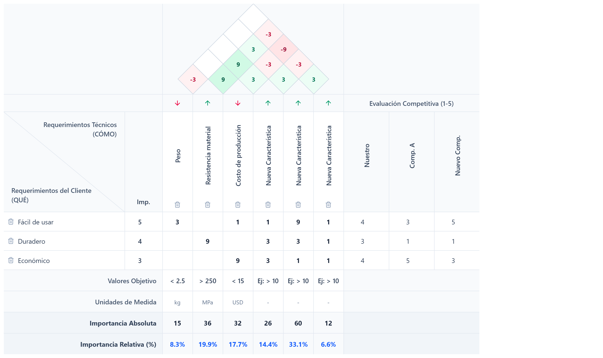

# Matriz QFD Pro

Aplicación web interactiva para construir y editar una **matriz QFD (Casa de la Calidad)** de forma rápida, visual y totalmente editable. Permite trabajar con requerimientos del cliente, requerimientos técnicos, relaciones, “techo” de correlaciones y análisis competitivo, todo en una sola vista. [github](https://github.com/oscampo/Matriz-QFD)

## Características principales

- Edición directa en la matriz: textos, importancias, unidades, objetivos y evaluaciones se modifican haciendo clic sobre cada celda.  
- Definición de requerimientos del cliente (QUÉ) con importancia de 1 a 5.  
- Definición de características técnicas (CÓMO) con dirección de mejora (maximizar, minimizar u objetivo).  
- Matriz de relaciones QUÉ vs CÓMO con niveles 1, 3 y 9 (débil, moderada, fuerte), seleccionados al hacer clic en cada celda.  
- “Techo” CÓMO vs CÓMO con correlaciones positivas y negativas (9, 3, -3, -9).  
- Evaluación competitiva por requerimiento (1 a 5) para varios competidores.  
- Cálculo automático de importancia absoluta y relativa de cada CÓMO según las relaciones y la importancia de los QUÉ.  
- Exportación e importación de datos en formato JSON para continuar el trabajo más adelante.  
- Exportación de la matriz como imagen PNG en alta resolución (ideal para informes y presentaciones).  

## Demo




- URL de la app: `https://oscampo.github.io/Matriz-QFD` (actualiza con la URL real).

## ¿Para qué sirve esta app?

La matriz QFD (Quality Function Deployment) ayuda a:

- Traducir la voz del cliente (QUÉ) a requerimientos técnicos de diseño (CÓMO).  
- Visualizar qué características técnicas tienen mayor impacto en la satisfacción del cliente.  
- Identificar conflictos entre CÓMOs mediante el “techo” de correlaciones.  
- Comparar tu producto frente a la competencia en cada requerimiento clave.

Es especialmente útil en:

- Diseño de productos y dispositivos.  
- Proyectos de ingeniería biomédica, mecánica y de producto.  
- Cursos de diseño, ingeniería de calidad y gestión de la innovación.

## Cómo usar la matriz QFD

1. **Definir los QUÉ (Requerimientos del Cliente)**  
   - En la columna izquierda, edita el texto de cada requerimiento.  
   - Ajusta la importancia (1–5) según la relevancia para el cliente.  

2. **Definir los CÓMO (Requerimientos Técnicos)**  
   - En la parte superior, edita el nombre de cada característica técnica.  
   - Define su unidad y el valor objetivo (por ejemplo: `> 250 MPa`, `< 2.5 kg`).  
   - Haz clic en el ícono de dirección para alternar entre **maximizar**, **minimizar** u **objetivo**.  

3. **Llenar la matriz de relaciones QUÉ vs CÓMO**  
   - Haz clic en las celdas centrales para rotar los valores: vacío → 1 → 3 → 9 → vacío.  
   - Usa 9 para relaciones fuertes, 3 para moderadas y 1 para débiles.  

4. **Llenar el “techo” CÓMO vs CÓMO**  
   - Haz clic en las celdas del techo para indicar la correlación entre CÓMOs.  
   - Los valores rotan entre 9, 3, -3, -9 y vacío.  

5. **Evaluar la competencia**  
   - Agrega competidores y edita sus nombres.  
   - Para cada QUÉ, califica cada competidor de 1 a 5.  

6. **Analizar resultados**  
   - La app calcula automáticamente la **importancia absoluta** y **relativa** de cada CÓMO.  
   - Usa estos valores para priorizar especificaciones de diseño y decisiones de ingeniería.

## Exportar e importar datos

- **Descargar JSON**  
  - Usa el botón “Descargar JSON” para guardar el estado actual de la matriz en un archivo `matriz-qfd.json`.  

- **Cargar JSON**  
  - Usa el botón “Cargar JSON” y selecciona un archivo exportado anteriormente para recuperar toda la información (QUÉ, CÓMO, relaciones, techo, competidores y evaluaciones).  

- **Descargar imagen**  
  - Usa el botón “Descargar Imagen” para exportar la matriz como PNG en alta resolución, lista para incluir en informes, presentaciones o documentación técnica.  

## Instalación y ejecución local

Este proyecto está desarrollado con **React + TypeScript + Vite**. [github](https://github.com/oscampo/Matriz-QFD)

1. Clonar el repositorio:

```bash
git clone https://github.com/oscampo/Matriz-QFD.git
cd Matriz-QFD
```

2. Instalar dependencias:

```bash
npm install
```

3. Ejecutar en modo desarrollo:

```bash
npm run dev
```

4. Construir para producción:

```bash
npm run build
```

5. Vista previa del build:

```bash
npm run preview
```

## Tecnologías utilizadas

- React  
- TypeScript  
- Vite  
- Tailwind CSS (para estilos utilitarios, según configuración del proyecto)  
- `html-to-image` para exportar la matriz como PNG.  
- Iconos `lucide-react`.  

## Autor

Desarrollado por el **Prof. Oscar Campo, PhD**  
- Email: [oicampo@uao.edu.co](mailto:oicampo@uao.edu.co)  
- GitHub: [@oscampo](https://github.com/oscampo) [github](https://github.com/oscampo/Matriz-QFD)

## Licencia

Esta app y sus recursos están bajo la licencia:  
[Creative Commons Atribución-NoComercial 4.0 Internacional](http://creativecommons.org/licenses/by-nc/4.0/).  

Es de uso libre mencionando al autor y no se permite su comercialización.  

